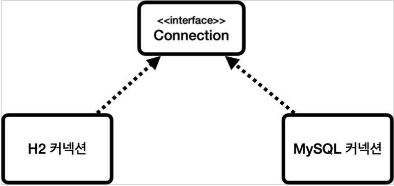

# 2. 데이터베이스 연결

## DB에 연결하기

- JDBC가 제공하는 **`DriverManager.getConnection(...)`** 을 사용한다.
    - 이 때 라이브러리에 있는 데이터베이스 드라이버를 찾아서 해당 드라이버가 제공하는 커넥션을 반환해준다.
    - 파라미터 : URL, USERNAME, PASSWORD
    - 반환된 커넥션
        - org.h2.jdbc.JdbcConnection
        - JDBC 표준 커넥션 인터페이스인 java.sql.Connection 인터페이스를 구현하고 있다.

### JDBC 커넥션 인터페이스와 구현

- JDBC는 java.sql.Connection 표준 커넥션 인터페이스를 정의한다.
- H2 데이터베이스 드라이버는 JDBC Connection 인터페이스를 구현한 org.h2.jdbc.JdbcConnection 구현체를 제공한다.
  

### DriverManager 커넥션 요청 흐름

- DriverManager가 커넥션이 필요로 한 상황이 오면 라이브러리를 검사해서 DB 벤더들의 드라이버 목록을 자동으로 인식한다.
- 각각의 드라이버들에게 URL과 USERNAME, PASSWORD 정보를 넘겨주면 해당 드라이버는 URL을 보고 자신이 처리할 수 있는지를 확인한다. (URL이 oracle이면 oracle 드라이버가 처리할 수 있다고 판단)
- 본인이 처리할 수 없는 요청이라면 처리할 수 없다는 결과를 반환 후 다음 순서의 드라이버로 넘기고, 처리할 수 있는 요청이라면 데이터베이스와 연결 후 획득한 커넥션을 반환한다.