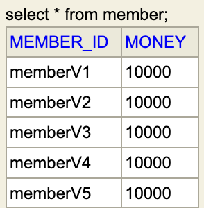

# 4. JDBC 개발 - 조회 (SELECT)

## JDBC 개발 - 조회

### ResultSet

- 조회할 때 사용하는 ResultSet은 응답데이터가 담긴 데이터구조이다. (쿼리 조회했을때 나오는 모습이랑 같다고 생각하면 될 듯)
    
    
    
- ResultSet 내부에는 커서(cursur)가 있어서 맨 처음에는 빈 곳을 가리킨다. 따라서 rs.next()로 다음줄로 이동했을때 데이터가 존재하면 true를 반환하고, 데이터가 없으면 false를 반환하게 된다.
    
    
    
- rs.getString(”member_id”) ⇒ 현재 커서가 가리키는 행의 member_id 컬럼의 값을 String 타입으로 반환한다
- rs.getInt(”money”) ⇒ 현재 커서가 가리키는 행의 money 컬럼의 값을 int 타입으로 반환한다

### 코드에서 ResultSet 사용하기

DB에서 memberId로 하나의 값을 조회해오는 메서드 생성 ( findById() )

```java
public Member findById( String memberId ) throws SQLException {

    String sql = "select * from Member where member_id = ?";

    Connection con = null; // finally 구문에서 호출해야 하기 떄문에 밖으로 빼서 선언한다
    PreparedStatement pstmt = null;
    **ResultSet rs = null;**

    try{
        con = getConnection();
        pstmt = con.prepareStatement(sql);
        pstmt.setString(1, memberId );

        **// executeUpdate()는 변경할때 사용하고, select 쿼리는 executeQuery()를 사용한다
        rs = pstmt.executeQuery();**

        **// rs.next()를 한 번은 호출해줘야 그 다음부터 실제 응답을 출력한다
        if ( rs.next() ){

            Member member = new Member();
            member.setMemberId( rs.getString("member_id") );
            member.setMoney( rs.getInt("money") );
            return member;
        }
        // 데이터가 없는 경우
        else{
            /* 에러 메시지를 작성할 떄 key값을 잘 넣어줘야 실제 운영에서 문제를 찾을 때 편리하다 */
            throw new NoSuchElementException("member not found, memberId = " + memberId );
        }**
    } catch (SQLException e) {
        log.error( "db error", e );
        throw e;
    }
    finally {
        close( con, pstmt, rs );
    }

}
```

테스트코드

```java
@Test
void crud() throws SQLException {
    // save
    Member member = new Member("memberV5", 10000);
    repository.save( member );

    // findById
    Member findMember = repository.findById(member.getMemberId());
    log.info( "findMember={}", findMember );

    // member == findMember false : member와 findMember는 다른 인스턴스이다. findMember는 ResultSet에서 담을때 생성한 인스턴스
    log.info( "member == findMember {}", member == findMember );

    // member.equals( findMember ) true
    // 이유: Member객체 만들때 사용한 @Data 롬복은 EqualsAndHashCode를 가지고 있다. 따라서 Member객체의 필드값들이 같다면 equals는 true가 된다
    log.info( "member.equals( findMember ) {}", member.equals( findMember ) );

    // 찾은 멤버가 방금 등록한 멤버와 같다
    assertThat( findMember ).isEqualTo( member );
}
```

> **참고** </br>
Member 객체인 findMember를 출력했는데 참조값이 나오지 않고 예쁘게 데이터가 출력되는 이유는? </br>
→ Member 객체에서 @Data 롬복 내부에 toString()을 오버라이드하고 있기 때문에 
isEqualTo()에서 true값이 나오는 이유도 @Data에서 EqualsAndHashCode를 가지고 있기 때문에 서로 다른 인스턴스임에도 필드값이 같아서 true가 나온다.
>