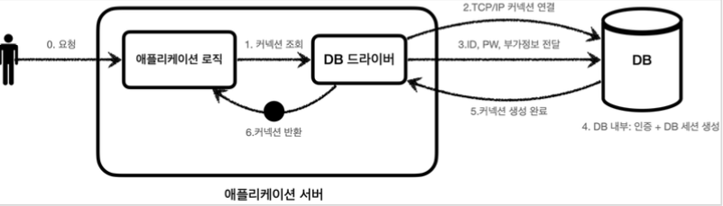

# 6. 커넥션풀과 데이터소스

## 요약

> **`tl;dr`**
> 1. **`커넥션 풀`은** 매번 DB에 커넥션을 요청하는 대신, 앱 구동시 DB와 커넥션을 **미리 맺어놓고** 커넥션 풀에 커넥션을 넣어둔 다음 필요할 때 즉시 커넥션을 사용하고 사용 후 다시 반환하도록 하는 방법이다.
> 2. **`DataSource`**는 **커넥션을 획득하는 방법을 추상화**하는 인터페이스이다.
> 3. DataSource를 통해 커넥션 풀의 구현 기술을 바꾸고 싶을 때 애플리케이션 로직의 수정없이 구현체만 갈아끼우면 된다.
 

## 1.  커넥션 풀의 이해

### 1) 데이터베이스 커넥션 획득 - DriverManager (가장 기본)



- DB드라이버를 통해 커넥션을 매번 획득하는 방법 ⇒ 과정도 복잡하고 소요시간이 커서 **`응답 속도에 영향`**을 줌
- 획득 과정
    1. 애플리케이션 로직은 DB 드라이버를 통해 커넥션을 조회한다.
    2. DB 드라이버는 DB와 TCP/IP 커넥션을 연결한다. 이 과정에서 3 way handshake 같은 TCP/IP 연결을 위한 네트워크 동작이 발생한다. (TCP/IP 커넥션을 생성하는데에도 시간이 소요됨)
    3. DB 드라이버는 TCP/IP 커넥션이 연결되면 ID, PW와 기타 부가정보를 DB에 전달한다.
    4. DB는 ID, PW를 통해 내부 인증을 완료하고, 내부에 DB 세션을 생성한다.
    5. DB는 커넥션 생성이 완료되었다는 응답을 보낸다.
    6. DB 드라이버는 커넥션 객체를 생성해서 클라이언트에 반환한다.

### 2) 데이터베이스 커넥션 획득 - 커넥션 풀


- 앞서 DriverManager로 매번 커넥션을 획득하는 방식의 단점을 해결하는 방법이 커넥션을 미리 생성해두고 사용하는 커넥션 풀(커넥션을 관리하는 풀)이라는 방법이다.
- 애플리케이션을 시작하는 시점에 커넥션 풀은 필요한 만큼 커넥션을 미리 확보해서 풀에 보관한다. (기본값은 보통 10개)
- 커넥션 풀에 들어있는 커넥션은 TCP/IP로 DB와 커넥션이 연결되어 있는 상태이기 때문에 언제든지 즉시 SQL을 DB에 전달할 수 있다.

### 커넥션 풀 사용


1. 애플리케이션 로직에서 커넥션 풀을 통해 이미 생성되어 있는 커넥션을 개체 참조로 가져다 쓴다.
    - 커넥션 풀에 커넥션을 요청하면 커넥션 풀은 자신이 가지고 있는 커넥션 중에 하나를 반환한다.
2. 애플리케이션 로직은 커넥션 풀에서 받은 커넥션을 사용해서 SQL을 DB에 전달하고 그 결과를 받아서 처리한다
3. 커넥션을 모두 사용하고 나면 **커넥션을 종료하는 것이 아니라**, 다음에 다시 사용할 수 있도록 **`그대로 커넥션 풀에 반환`**한다. (연결이 살아있는 상태로)

### 정리

- 적절한 커넥션 풀 숫자는 성능 테스트를 통해서 알맞게 정해야 한다.
- 커넥션 풀을 통해 얻는 이점이 매우 크기 때문에 **실무에서는 항상 기본으로 사용**한다.
- 사용도 편리하고 성능도 뛰어난 오픈소스 커넥션 풀이 많기 때문에 오픈소스를 사용하는 것이 좋다.
    - 대표적인 커넥션 풀 오픈소스는 **HikariCP**, commons-dbcp2, tomcat-jdbc pool 등이 있다.
    - 스프링 부트 2.0부터는 기본 커넥션 풀로 hikariCP를 제공한다. (이미 검증됨) 따라서 고민없이 hikariCP를 사용하면 된다.

## 2. DataSource 이해


### DriverManager를 통해 커넥션을 획득하다가 커넥션 풀 방식으로 변경한다면?


- 의존관계가 DriverManager에서 HikariCP로 변경되기 때문에 **애플리케이션 코드도 함께 변경**해야 한다.

### DataSource - 커넥션을 획득하는 방법 추상화


- 위의 문제를 해결하기 위해 자바에서는 **`javax.sql.DataSource`**라는 인터페이스를 제공한다.
- **DataSource : 커넥션을 획득하는 방법을 추상화** 하는 인터페이스
    - 핵심 기능은 커넥션 조회 하나이다.
    
    ```java
    public interface DataSource {
        Connection getConnection() throws SQLException;
    }
    ```
    

### 정리

- 대부분의 커넥션 풀은 DataSource 인터페이스를 이미 구현해두었다. 따라서 개발자는 애플리케이션 로직이 **DataSource 인터페이스에만 의존**하도록 작성하면 된다.
- DriverManager는 DataSource 인터페이스를 사용하지 않는다.  하지만 스프링이 DriverManager도 DataSource를 통해서 사용할 수 있도록 **DriverManagerDataSource**라는 DataSource 구현 클래스를 제공한다.